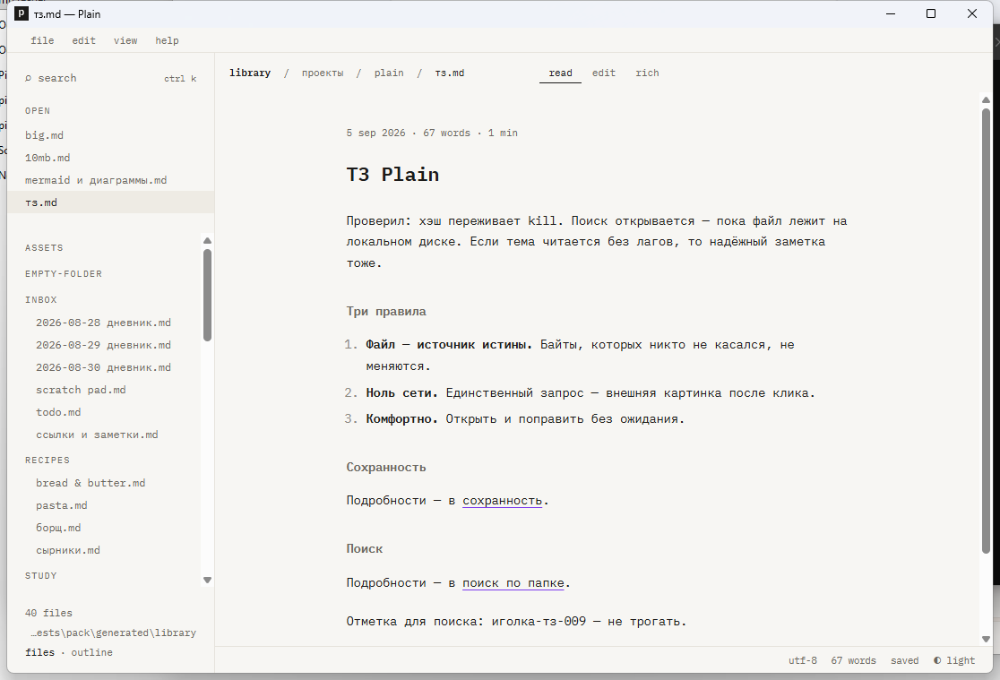
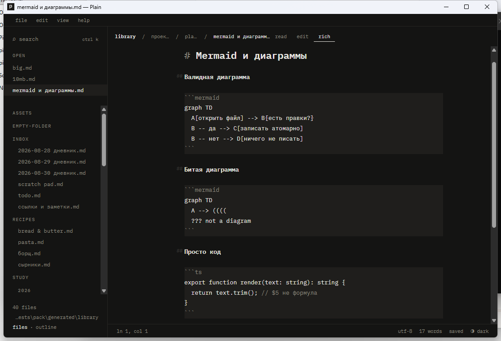

# Plain

A lightweight Markdown reader and editor for Windows 11 and macOS.

Double-click a `.md` file and you are reading. Make a change, and the file stays yours, byte for byte. Your library is a plain folder on disk: no database, no account, no network.





## What it does

- **Three views of one document.** `read` renders the text, `edit` shows the source with syntax highlighting, and `rich` shows the source with the markup hidden, the way Typora does. Switch with `Ctrl+/` or by clicking the mode bar.
- **All the Markdown you need.** Tables, task lists, footnotes, callouts like `> [!note]`, KaTeX math, Mermaid diagrams, syntax-highlighted code, `==highlights==`, `[[wikilinks]]`, and images from your folder.
- **A folder as a library.** A file tree, create, rename, delete to the Recycle Bin or Trash, and full-text search across the folder.
- **Quick open.** `Ctrl+K` finds files by name, lists recent ones, and runs commands.
- **Careful saving.** Atomic writes, encodings and line endings preserved, recovery drafts in case of a crash, and a warning when a file changes on disk while you have it open.
- **A quiet interface.** One monospace font, light and dark themes, no toolbars, no icons.

## Installation

Builds for both systems are on the [releases page](https://github.com/gregmos/plain/releases). Nothing else needs to be installed: no Node, no Rust, no separate WebView2 runtime.

### Windows 11

1. Unpack `Plain-0.2.0-win-x64.zip` into any folder, for example `C:\Program Files\Plain` or `%LOCALAPPDATA%\Programs\Plain`. It contains a single `plain.exe`; there is no installer.
2. Run `plain.exe`. The exe is code-signed and timestamped (signer **Grigorii Moskalev**, certificate issued by Certum; right-click → Properties → Digital Signatures shows it). Windows SmartScreen may still show a blue "Windows protected your PC" dialog on first launch while the certificate is new and has no download reputation yet: click **More info → Run anyway**. Windows remembers the decision for that copy of the file.
3. To open `.md` files in Plain with a double-click: right-click any `.md` file → **Open with → Choose another app → Plain → Always**. Plain appears in that list after its first launch, but it never makes itself the default on its own.

If you move the folder later, just run the exe from its new location.

### macOS 13+

1. Download `Plain_0.2.0_universal.dmg`, open it, and drag Plain into Applications. One build runs on both Apple Silicon and Intel.
2. The app is signed ad hoc, without a Developer ID or notarisation, so macOS refuses the first launch. On macOS 15 (Sequoia) and later: open it once, let the refusal appear, then go to **System Settings → Privacy & Security** and click **Open Anyway** next to Plain. On macOS 13 and 14: right-click the app in Applications and choose **Open**. Terminal alternative for either: `xattr -dr com.apple.quarantine /Applications/Plain.app`. After that it opens normally.
3. To open `.md` files from Finder with a double-click: select any `.md` file, **Get Info → Open with → Plain → Change All**. Plain is listed there from its first launch.

## Using it

- **Open a file.** Double-click it in Explorer or Finder, drop it onto the window, or press `Ctrl+O`.
- **Open a folder.** Press `Ctrl+Alt+O` or drop a folder onto the window. The file tree appears on the left, and `Ctrl+Shift+F` searches the contents of every file in it.
- **Edit.** `Ctrl+/` switches between reading and editing. Format with the usual shortcuts (`Ctrl+B`, `Ctrl+I`, `Ctrl+Shift+K`…) or with the small panel that appears above selected text.
- **Save.** `Ctrl+S`. Until you save, a `•` shows in the title, and a recovery draft is already stored in a safe place: if the program or the computer shuts down, Plain offers to restore your text on the next launch.
- **Settings.** `Ctrl+,` opens theme, font size, column width, line numbers, and a few more. Changes apply immediately.
- **Everything else** lives in the `file · edit · view · help` menu and in the command palette, `Ctrl+Shift+P`.

## Keyboard shortcuts

The complete list is inside the app: `help → shortcuts` or `F1`. On a Mac, `⌘` takes the place of `Ctrl`; the few combinations macOS reserves are remapped and listed there too. Shortcuts work in any keyboard layout, so `Ctrl+B` is bold even when the layout is Cyrillic.

## Where your data lives

On Windows in `%APPDATA%\Plain` (that is `C:\Users\<you>\AppData\Roaming\Plain`), on macOS in `~/Library/Application Support/Plain`:

| File | Contents |
|---|---|
| `settings.json` | settings; easier to change with `Ctrl+,` |
| `drafts\` | recovery drafts of unsaved edits |
| `state.json` | open files, reading positions, the last folder |
| `history\` | snapshots of what you saved, kept for thirty days |

On Windows, a folder called `data` next to `plain.exe` makes Plain keep all four there instead (portable mode); the macOS app is a bundle, so there is no portable mode there. Plain keeps no indexes, caches, or hidden service files in your folders. The only things it writes there are the documents you save and, if you paste an image, the `assets/` folder next to the document.

## How it treats your files

- Bytes you did not touch do not change: list markers, indentation, trailing spaces, the byte order mark, the final newline.
- Line endings are kept as they were, CRLF or LF. If a file mixes both, saving picks the dominant style and says so in the status bar.
- The encoding is kept: UTF-8, UTF-8 with BOM, UTF-16. For a legacy cp1251 file, Plain offers to convert it to UTF-8 the first time you save.
- Writes are atomic: the text goes to a temporary file next to the original, which is then replaced in one step. An interrupted write cannot corrupt a document.
- If a file changes on disk while it is open: with no edits of your own, it is reloaded quietly; with edits, Plain shows a warning and never overwrites the other change.

## Building from source

On Windows you need Node.js 22, Rust (`rustup` with the `stable-x86_64-pc-windows-msvc` toolchain), and Visual Studio Build Tools with the "Desktop development with C++" workload. On a Mac: Node.js 22, Rust, and the Xcode Command Line Tools; `npm run tauri build --bundles dmg` produces the `.dmg` there.

```
npm install
npm run tauri dev     # development build with live reload
npm run pack          # signed release build, produces dist-win\Plain-0.2.0-win-x64.zip
npm run pack -- -Unsigned   # unsigned local test build (dist-win\...-unsigned.zip, never published)
```

The Windows exe is signed with the maintainer's Certum code-signing certificate through SimplySign Desktop, so `npm run pack` needs an open SimplySign session (tray → Connect to SimplySign, token from the phone app) and stops before building if there is none; `scripts/pack.ps1` has the details. The signature is verified, timestamp included, before the zip is made.

Checks: `npm run build`, `npx vitest run`, and `cargo test` inside `src-tauri`. The manual checklist used before a release is in `CHECKLIST.md`.

The released macOS build comes from CI (`.github/workflows/macos.yml`, on a `v*` tag or by hand): the same three checks on `macos-latest`, then a universal `.dmg` attached to the release.

Stack: Tauri 2, React, CodeMirror 6, unified (remark and rehype), Shiki, KaTeX, Mermaid. Rust handles the file system, folder watching, and search.
