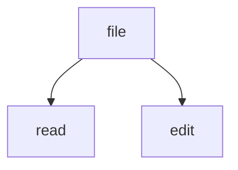

# Code and math

## Fences

```ts
export function render(text: string): string {
  return text.trim();
}
```

```python
def render(text: str) -> str:
    return text.strip()
```

```rust
fn render(text: &str) -> String {
    text.trim().to_string()
}
```

```
$ ls notes/
ideas.md  on-plain-text.md  reading-list.md
```



Indented code still works:

    plain four spaces
    second line

## Math

Inline: $E = mc^2$ and $\alpha + \beta$.

Display:

$$
\int_0^1 x^2 \, dx = \frac{1}{3}
$$

## Not math

Цена $5 и $10 за штуку. От $100 — $200 за коробку. Скидка $50, итого $150.

A code span keeps its dollars: `$5 + $10`.

## Wikilinks in code

`[[not a link]]` and:

```
[[also not a link]]
```
