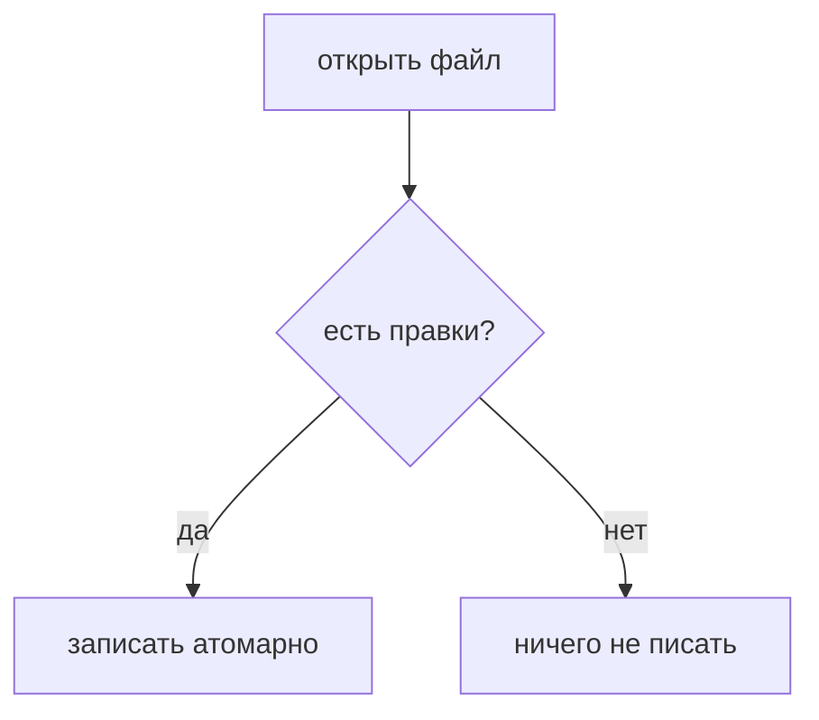

# Mermaid и диаграммы

## Валидная диаграмма



## Битая диаграмма

```mermaid
graph TD
  A --> ((((
  ??? not a diagram
```

## Просто код

```ts
export function render(text: string): string {
  return text.trim(); // $5 не формула
}
```

```rust
fn main() {
    println!("привет");
}
```

```unknown-language-xyz
ничего не подсветится
```

Отметка для поиска: иголка-mermaid-013 — не трогать.
